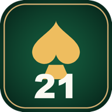
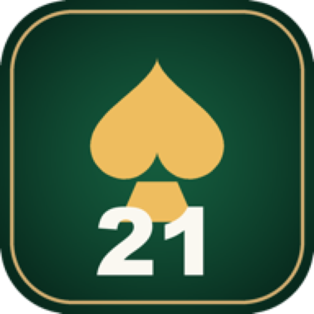
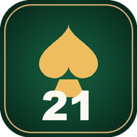
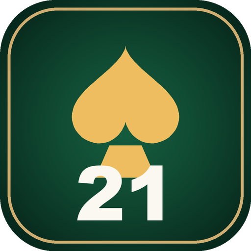

# App Icons

A catalogue of every app-icon asset in this repo, where it lives, what size it is, and whether
it's the branded "21 Sweet Pot" mark or still the stock Flutter template logo. Regenerate branded
icons from the same casino-green/gold Ace-of-Spades-and-"21" design described in
[README.md → Assets](../README.md#assets) if the design ever changes; there is no checked-in
source file or generator script for the icon set today, so a design change means re-exporting
every size below by hand (or wiring up a generator, see **Gaps** at the bottom).

## Branded (21 Sweet Pot mark)

| Platform | Preview | Path | Sizes |
|---|---|---|---|
| Android launcher |  | `android/app/src/main/res/mipmap-*/ic_launcher.png` | 48×48 (mdpi), 72×72 (hdpi), 96×96 (xhdpi), 144×144 (xxhdpi), 192×192 (xxxhdpi) |
| Google Play Store listing |  | `play-assets/icon-512.png` | 512×512 |
| Web favicon |  | `web/favicon.png` | 196×196 |
| Web / PWA home-screen |  | `web/icons/Icon-192.png`, `web/icons/Icon-512.png` | 192×192, 512×512 |
| Web / PWA maskable |  | `web/icons/Icon-maskable-192.png`, `web/icons/Icon-maskable-512.png` | 192×192, 512×512 |

Android has no `ic_launcher_round.png` in any density folder — the launcher uses the square
`ic_launcher.png` on every density, so round-icon launchers (most stock Android skins) crop it
into a circle at display time rather than using a purpose-drawn round asset.

## Not yet branded (stock Flutter logo)

| Platform | Preview | Path | Sizes |
|---|---|---|---|
| iOS / TestFlight |  | `ios/Runner/Assets.xcassets/AppIcon.appiconset/Icon-App-*.png` | 20, 29, 40, 60, 76, 83.5pt at 1x/2x/3x (20×20 up to 180×180), plus 1024×1024 |
| macOS |  | `macos/Runner/Assets.xcassets/AppIcon.appiconset/app_icon_*.png` | 16, 32, 64, 128, 256, 512, 1024 |
| Windows | *(`.ico`, not previewable inline)* | `windows/runner/resources/app_icon.ico` | 256×256 down to 16×16, multi-res `.ico` |
| Linux | — | no icon configured | Flutter's Linux template ships without a bundled app icon; the window manager's default is used |

This matches the note in the README changelog (2026-08-15 (4)): only the Android launcher icons
and `play-assets/` were ever branded, and the iOS build still ships the Flutter logo. That gap now
also covers macOS and Windows, which use the same stock template assets iOS does.

## Gaps

- No source `.svg`/`.ai`/`.psd` for the "21 Sweet Pot" mark is checked in — the web assets were
  produced by a one-off Pillow script (see README → Assets) that isn't in the repo either, so
  reproducing the exact mark at a new size means recreating that script or exporting from
  whatever local file generated it.
- iOS, macOS, and Windows icons need to be branded to match Android/Play/web before a real
  App Store or desktop release — right now they'd ship the generic Flutter logo.
- Consider a `flutter_launcher_icons`-style config so future rebrands regenerate every platform's
  icon set from one master image instead of hand-exporting each size again.
